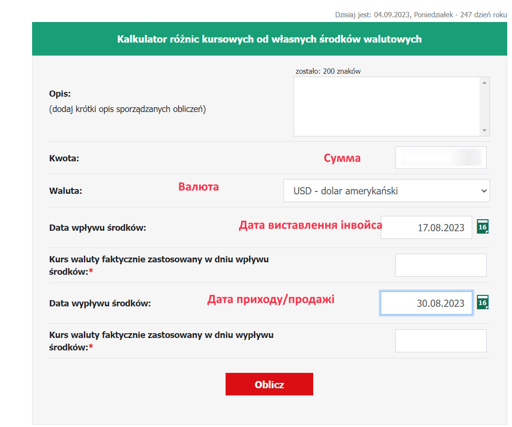
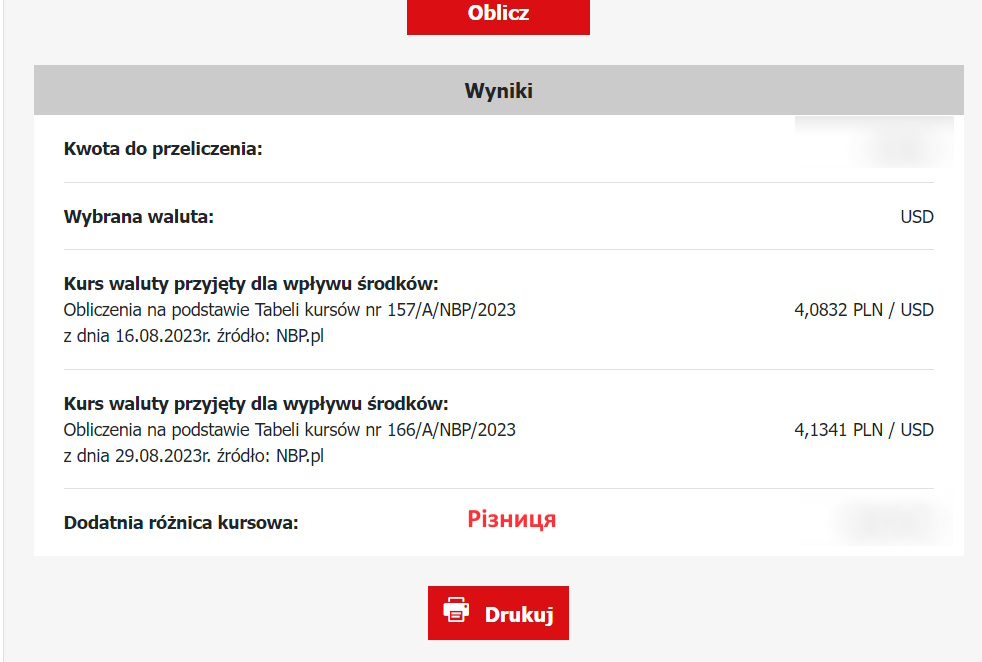
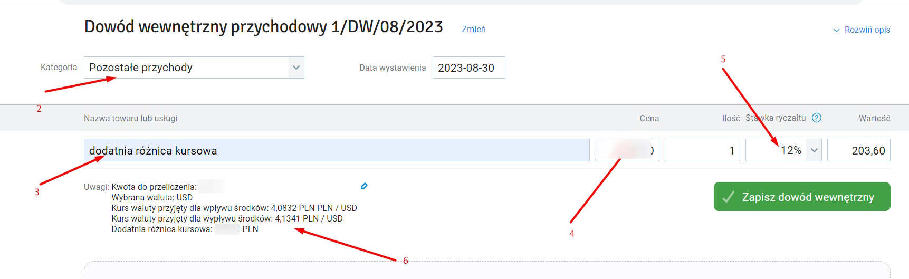

title: Реєстрація курсової різниці

# Для чого

Потрібна, коли рахуються податки, і курс на день виставлення фактури (CR1) відрізняється від дня зарахування коштів (CR2) і продажі валюти (CR3). Тому, найкраще продати валюту в тойже ж день, що і отримали її. Інструкція від інфакту - [курсова різниця](https://www.infakt.pl/blog/jak-rozliczyc-roznice-kursowe-na-ryczalcie/)

## Розрахунок
1. Йдемо на [сайт](https://kalkulatory.gofin.pl/kalkulatory/kalkulator-roznic-kursowych-od-wlasnych-srodkow-walutowych) для розрахунку різниці
2. Вводимо дату виставлення інвойсу, дату приходу(обміну) валюти, валюту, сумму:
<a> </a>
3. Копіюєте отриману різницю:
<a> </a>

## Внесення різниці
Для внесення різниці треба додати `Dowód wewnętrzny`` в infakt

1. `Przychody` -> `Przegląd` -> бургер-кнопка -> `Dowód wewnętrzny`
<a> </a>
2. Далі вибираємо Kategoria: `Pozostałe przychody`
3. Вводимо Nazwa towaru lub usługi: `dodatnia różnica kursowa` (після продажу валюти ви в плюсі) чи `ujemna różnica kursowa` (після продажу валюти ви в мінусі)
4. Суму, з мінусом, якщо після продажу валюти ви в мінусі
5. Ставка податку (12%, в моєму випадку)
6. (опційно) деталі по курсам, в форматі: 
```  
  Kwota do przeliczenia: {продана кількість валюти}
  Wybrana waluta: USD
  Kurs waluty przyjęty dla wpływu środków: {курс на дату ортимання} PLN / USD
  Kurs waluty przyjęty dla wypływu środków: {курс на дату продажі} PLN / USD
  Dodatnia różnica kursowa: {курсова різниця} PLN
```
<a> </a>
7. Зберігаємо 