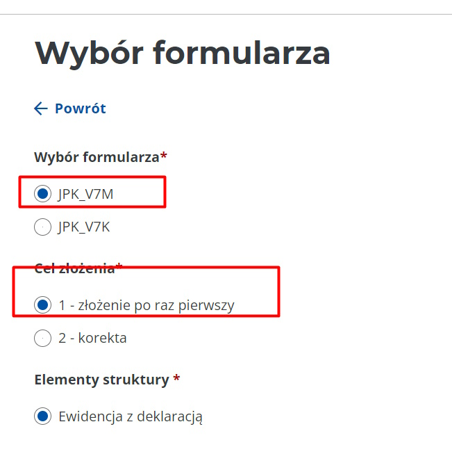
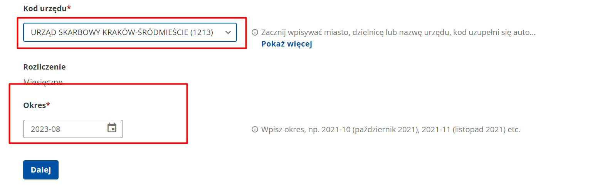
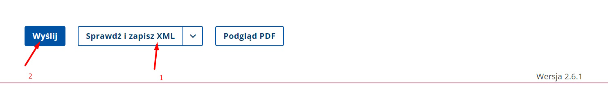
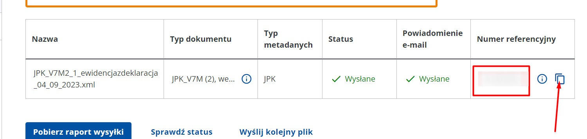

title: Декларація VAT

# Коли подавати

До 20 числа кожного місяця. По ідеї, в мене нульовий VAT, але його всерівно треба подавати

## Подача VAT декларації

1. Заходимо на [microfirma](https://e-mikrofirma.mf.gov.pl/jpk-form/) від мінфіна
2. Вибираємо `JPK_V7M` (місячний звіт) і `1 - złożenie po raz pierwszy`

3. Далі `URZĄD SKARBOWY KRAKÓW-ŚRÓDMIEŚCIE (1213)` і місяць

3. Вводим особисті дані (NIP, імя і так далі)
4. `Dalej` (нічого тут цікавого нема)
5. Вписати квоту 0
6. `Sprawdź i zapisz XML` (у мене в папку `FOP Pol`) і `Wyślij`

7. `Dalej`
8. `Podpisz dokumenty` профілем зауфованим
9. `Wyślij` відправити документ
10. Копіюємо ref number про всяк випадок (`FOP Pol/VAR ref.txt`)

11. Це все. Можна, про всяк випадок, провірити статус.