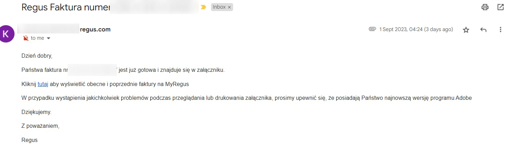
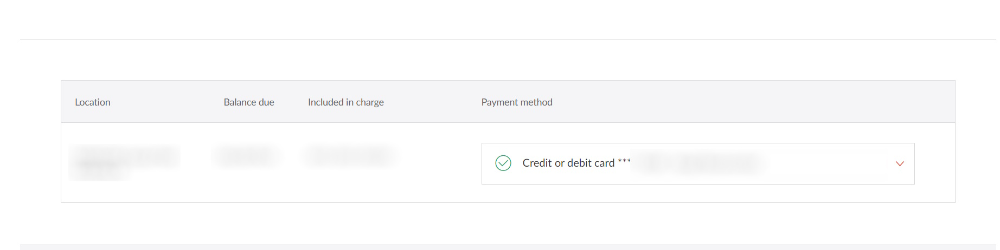

title: Оплата віртуального бюро

Я використовую [regus](https://www.regus.com/en-us){:target="_blank"}
## Коли оплачувати

На початку місяця
## Інструкція
1. На початку місяця отрмаєте листа з фактурою про оплату віртуального бюро:
  
2. Клікаєте на лінк (перевірити, чи точно рефіректить на регус)
3. Вибираєте оплатити
  
4. Оплачуєье карткою  
5. Після цього, через деякий час, інвойс буде відмічений, як оплачений

В Регуса трохи тупа система, з тими інвойсами не до кінця зрозуміло, що оплачено, що ні...