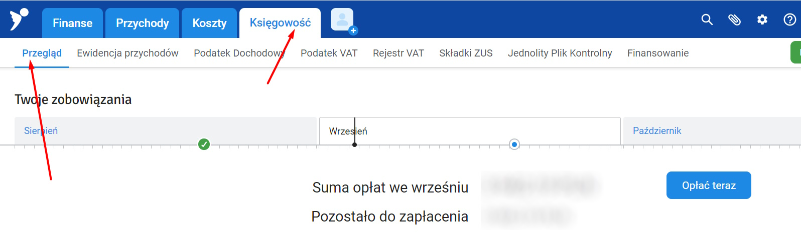
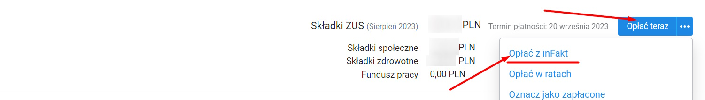
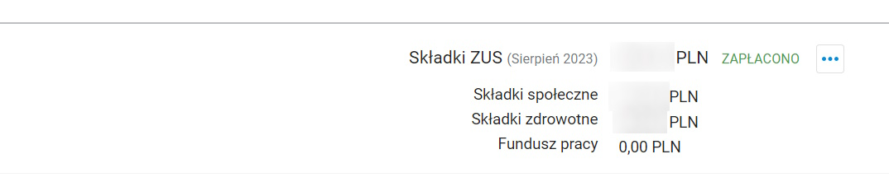

title: Оплата ZUS

# Коли оплачувати

До 20 числа кожного місяця

## Інструкція

1. `infakt` -> `Księgowość` ->`Przegląd`

2. Тиснемо `Opłać teraz`->`Opłać z inFakt` в `Składki ZUS`:

3. Вибираємо банк (PKO в моєму випадку). Далі оплата відрізняється від банку до банку, тому це для PKO далі
4. Логуємося в банк
5. Вибираємо звідки платити (`BIZNES PARTNER`)
6. Dalej
7. Підтвердження оплати через мобільну аплікуху
8. Через пару хв оплата ZUS сама буде відмічена як сплачена

