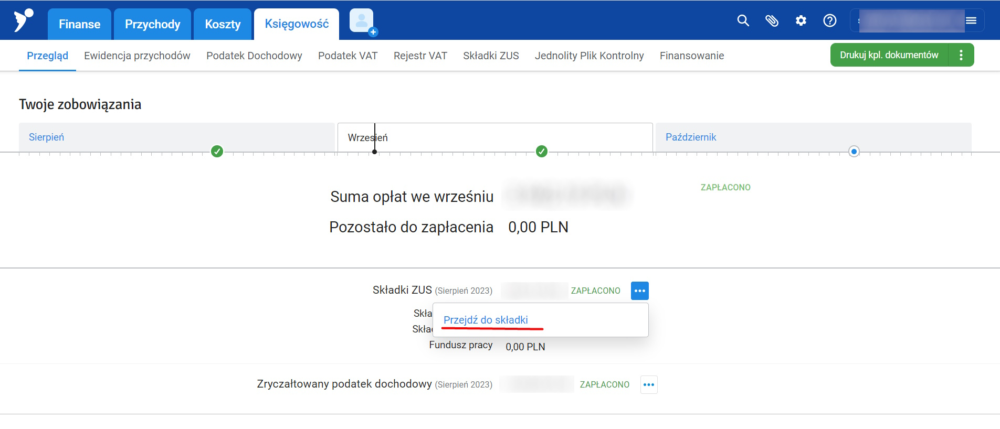
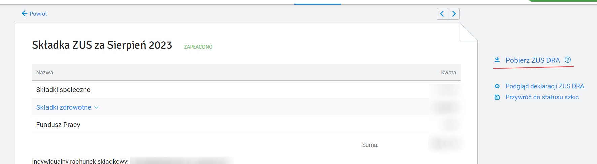
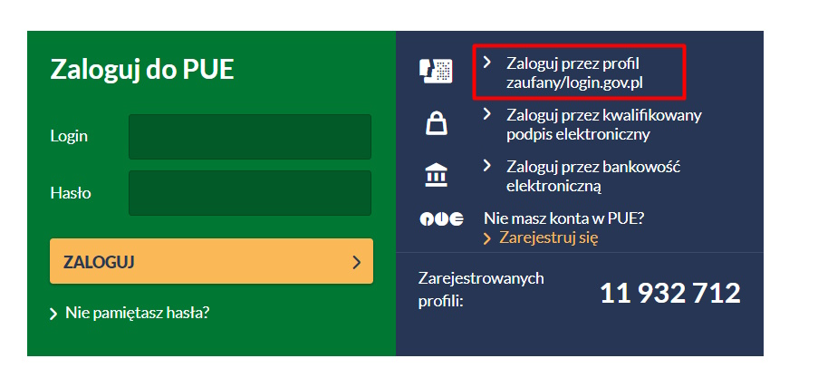
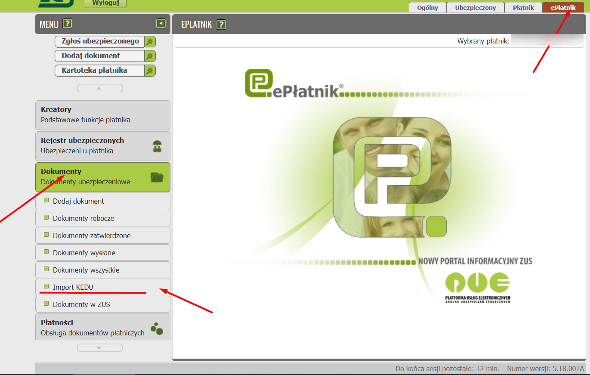
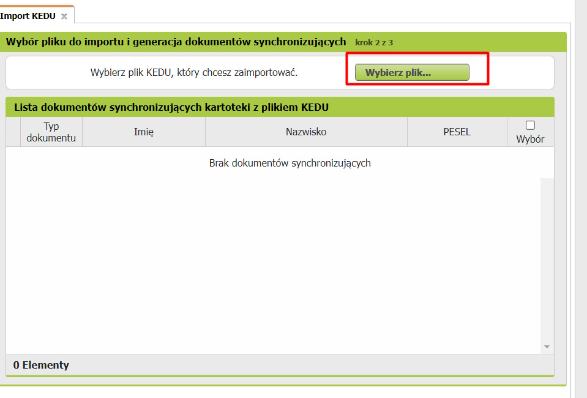
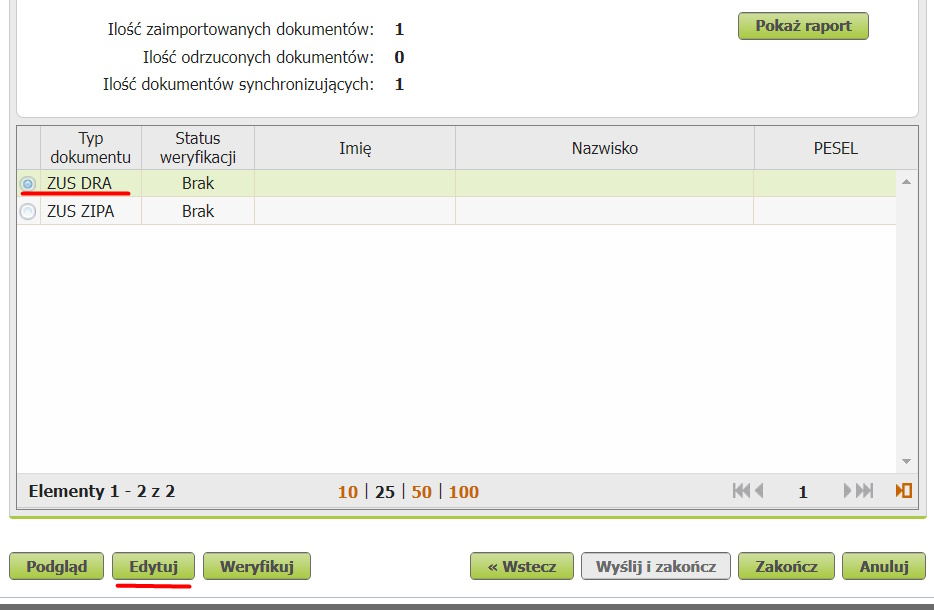
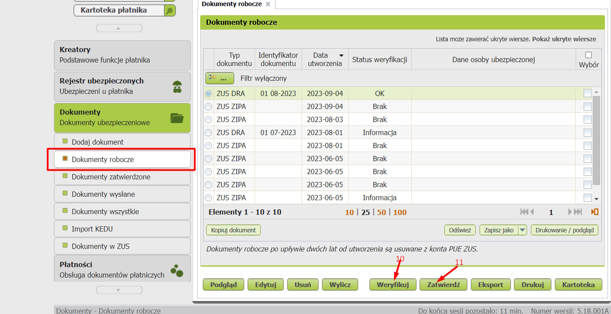
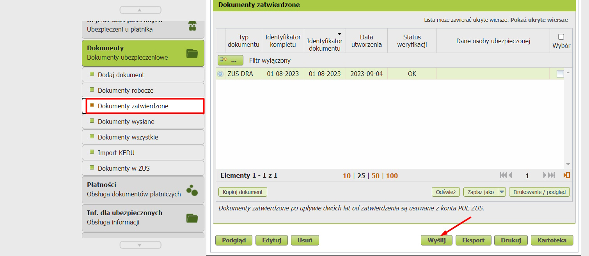

title: Подача декларації ZUS 

# Коли подавати

До 20 числа кожного місяця, після [оплати внесків до ZUS](/routine/zus)

## Збереження DRA файлу

1. `infakt` -> `Księgowość` ->`Przegląd` -> `Składki ZUS` -> `Opłać teraz` -> `Przejdź do składki`

2. Тиснемо `Pobierz ZUS DRA` щоб стянути DRA (я зберігаю в `FOP Pol\ZUS checks`)

## Заливання DRA файлу в ZUS
1. Логінемося в [ZUS](https://www.zus.pl/portal/logowanie.npi) через довірчий профіль (profil zaufany). Воно інколи тупить, можна через щось подібне до банкІд

2. Заходимо в закладку [ePlatnik](https://www.zus.pl/portal/eplMain.npi) -> `Dokumenty` -> `Import KEDU`

3. Проходимо `Dalej` до кроку 2 (`Wybór pliku do importu i generacja dokumentów synchronizujących)
4. Тиснемо `Wybierz plik...` і вибираємо *.dra файл
 
5. Проходимо `Dalej` до кроку 3 (`Utworzenie i walidacja dokumentów`)  
6. Вибераємо `ZUS DRA`
7. Тиснемо `Edytuj`

8. Валідємо, натиснувши `Sprawdź` і далі `Zamknij` (сподіватимемось, що не буде помилки)
9. Натиснути Zakończ і перейти в до вкладки `Dokumenty robocze`
10. Якщо статус не OK (чомусь) - `Weryfikuj`
11. Якщо статус OK - `Zatwierdź`

12. Перейти в до вкладки `Dokumenty zatwierdzone`
13. Тиснемо `Wyślij`

14. Підписуємо ePUAP (довірчий профіль). Чогось зараз не спрацював, спробую вислати завтра
